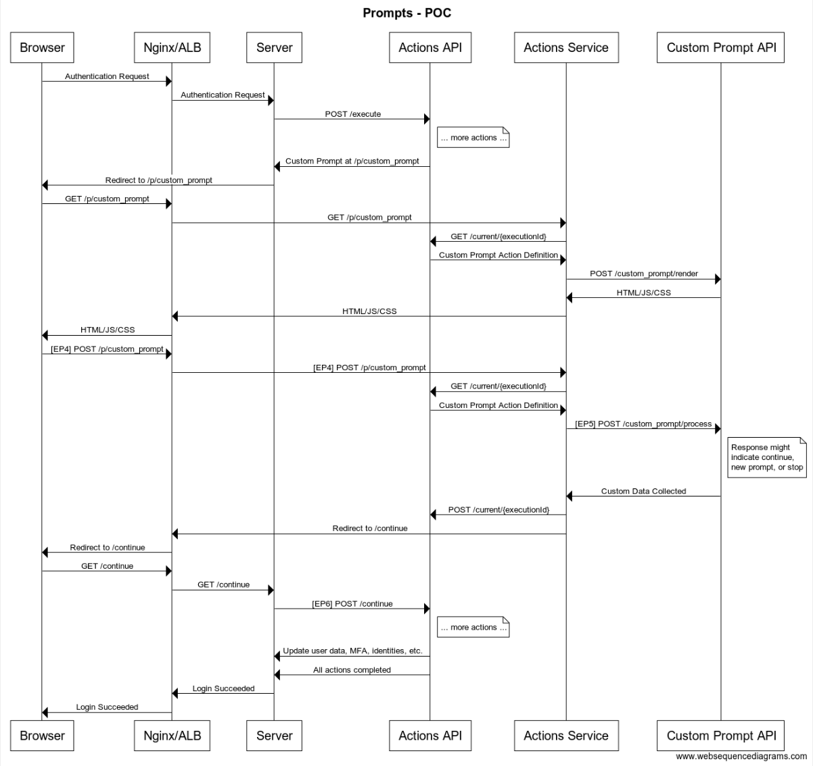

# POC Actions API

👋 Hi there! I'm your friendly Actions API service! You can see how I fit into this system in the diagram below.



I have the following endpoints:

### POST `/execute`

You can POST an object here looks something like this:

```json
{
	"stage":"post_login",
	"user":{"id": "auth0|123456789"},
	"context":{"clientId":"1q2w3e4r5t6y7u8i9o0p", "domain":"tenant.auth0.com"},
	"config":{"secret1":"q1w2e3r4t5y6u7i8o9"}
}
```

See that `stage` property? That should be one of the ones in `ALLOWED_STAGES` found [here](lib/constants.js). The other properties have to be there and have to be objects for now.

What you should get back, if I'm available and healthy, is another object (you're welcome 😊) that looks like this:

```json
{
    "executionId": "35fe8f6a-624c-485b-8308-8c11cf48b24c",
    "status": "success",
    "actionLog": [
        {
            "name": "validate_email_domain",
            "type": "code",
            "status": "success"
        }
    ]
}
```

👆 That tells you that we processed an action (just one this time) and everything turned out OK. Make sure to hang on to that `executionId` because that's the only one like it in the whole world and it's really special. You'll also need it later. 

This response:

```json
{
    "executionId": "35fe8f6a-624c-485b-8308-8c11cf48b24c",
    "status": "error",
    "actionLog": [
        {
            "name": "validate_email_domain",
            "type": "code",
            "status": "error"
        }
    ]
}
```

... is really unfortunate and I'm sorry but it tells us that something happened during the Actions being processed and we probably should stop the login and let the user down easily. My condolences. 

But I also have this cool trick:

```json
{
    "executionId": "35fe8f6a-624c-485b-8308-8c11cf48b24c",
    "status": "pending",
    "actionLog": [
        {
            "name": "terms_and_conditions",
            "type": "prompt",
            "status": "pending",
            "action": "prompt"
        }
    ]
}
```

... which tells our caller that there is some kind of user data needed to continute and that it's time to talk to my friend, Action Service. She's **amazing** 🤩. 

### GET/POST `/current/{executionId}`

In fact, she's **so** great that I made an endpoint just for her. Not only that, it's one that will accept GET **and** POST! Pretty nice of me, huh?

You'll need that special `executionId` I gave you before. If you GET this endpoint, you'll get back big bag of JSON telling you all about this execution, what we're waiting for, if anything, what I think the `user` is right now ... all really great stuff.

```json
{
    "user": {
        "id": "auth0|123456789",
        "email_domain_valid": true,
        "user_metadata": {
            "geo": "100,200",
            "twitter": "fakeuser"
        }
    },
    "context": {
        "clientId": "1q2w3e4r5t6y7u8i9o0p",
        "domain": "tenant.auth0.com"
    },
    "actionLog": [
        {
            "name": "validate_email_domain",
            "type": "code",
            "status": "success"
        },
        {
            "name": "enrich_profile",
            "type": "code",
            "status": "success"
        }
    ],
    "pipeline": [
        {
            "name": "validate_email_domain",
            "type": "code"
        },
        {
            "name": "enrich_profile",
            "type": "code"
        }
    ]
}
```

First the easy stuff. The `pipeline` property is the whole set of Actions that I've been asked to run for this user during this stage. The `actionLog` is what I have already done ✨ and what's left on my to-do list. So you might see something like this:

```json
{
    // ...
    "actionLog": [
        {
            "name": "terms_and_conditions",
            "type": "prompt",
            "status": "pending",
            "action": "prompt"
        }
    ],
    "pipeline": [
        {
            "name": "terms_and_conditions",
            "type": "prompt",
            "renderPromptUrl": "...",
            "handlePromptUrl": "..."
        },
        {
            "name": "enrich_profile",
            "type": "code"
        }
    ]
}
```

Crazy, right? This says that I have two total tasks on my `pipeline` list and I'm on the first task and I'm waiting on something to happen. In this example, I'm waiting on some data from that `terms_and_conditions` prompt.

Makes sense? Awesome. I had a feeling you were pretty sharp 🧠

I'll sit around and wait as long as you need to get the data needed from the user. When you're done with that, just come back to me with a POST on this endpoint along with whatever you need me to update and where we stand with this execution. It should look something like this:

```json
{
	"action": "continue",
	"user": { 
		"data1": "asas8ycans897ya", 
		"data2": "i0i239euje23oi"
	},
	"context":{
		"cdata1": "dfgdfgfdgsc8d9us9c8udfdfdfgscd", 
		"cdata2": "dfgdfgdfg3lkn45l3kn45"
	}
}
```

First, I'll take the `user` object (if you were kind enough to provide one) and update both the pipeline `user.user_metadata` **and** the *actual* user stored in Auth0 😮. Amazing, right? 

Then, I'll take the `context` parameter and add it to `context.actions.this_action_name` so you can use it later in the pipeline if you need to. 

Ooops, gotta go ... BRB with more!